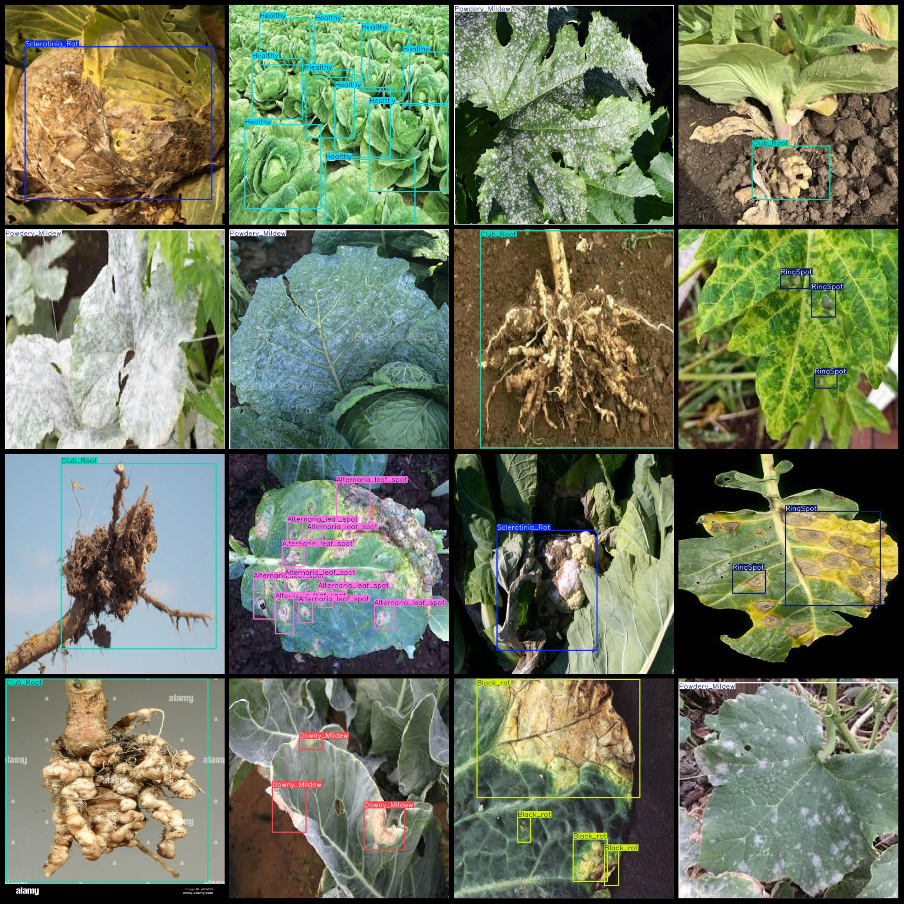
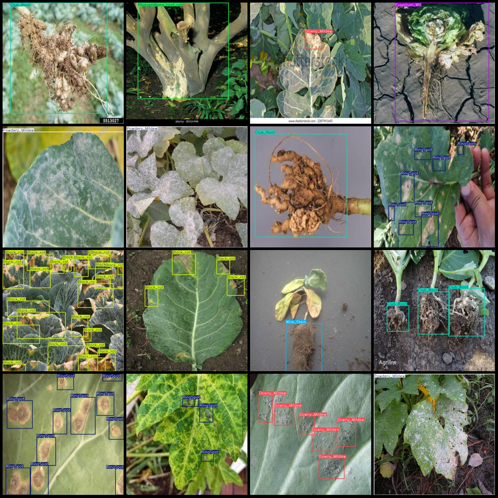

# Big-Cabbage Leaf Disease Detection Dataset VOC+YOLO format with 238 images in 12 categories

The dataset format is Pascal VOC format+YOLO format. It does not contain any split paths in the txt file, only the jpg image and the corresponding VOC format xml file and yolo format txt file.
number of images: 238  
annotation count: 238  
The number of annotated files (txt files) is 238.
Label count: 12
["Alternaria leaf spot", "Bacterial leaf spot", "Black rot", "Club root", "Downy mildew", "Fusarium wilt", "Healthy", "Phytophthora root rot"]
"Powdery_Mildew","RingSpot","Sclerotinia_Rot","Wire_Stem"]  
Box count for each category
Alternaria leaf spot (chain spot) frame = 95
Bacterial Leaf Spot (50 boxes)
Black Rot (60 boxes)
Club Root (57 boxes)
Downy Mildew (341 frames)
Fusarium Wilt (5 boxes)
Healthy (52 boxes)
Phytophthora Root Rot (10 boxes)
Powdery mildew (40)
RingSpot (ringspot) box count = 143
Sclerotinia Rot (sclerotinia rot) box count = 22
Wire Stem (wire stem) box count = 21
Total number of frames: 896
images per class:   
Alternaria leaf spot (Chain fungus leaf spot)
Bacterial_leaf_spot images = 3
Black_rot images = 6
Club_Root (root rot) occupies = 40
Downy_Mildew (powdery mildew) occupies a picture count of 40.
Fusarium Wilt images = 5
Healthy Pictures ownership = 23
Phytophthora root rot (Phragmopsis root rot) has 10 images.
Powdery Mildew (40 images)
Ring Spot (18 images)
Sclerotinia Rot (20 images)
Wire Stem (19 images)
image resolution: 640x640  
Use annotation tool: labelImg
Annotation rules: draw a rectangle around the class.
Important notes: The dataset does not include a division into training, validation, and test sets. You must divide it yourself.
Special statement: This dataset does not guarantee the accuracy of the models or weightsfile used for training.
Preview of the image:
## Images

Here is a pay link on Stripe ( https://buy.stripe.com/3cs8yP7sY87d0vu9AB ). Please contact me lonlonago@foxmail.com after funding $89, and I will send you a complete data files , thank you!

